# Neuro-Logistics Frontend Development Guide
## React + Node.js Implementation

**Platform:** Google Antigravity  
**Framework:** React 18 + Vite  
**Styling:** TailwindCSS  
**State Management:** Zustand  
**Maps:** Mapbox GL / Leaflet  
**Real-time:** Socket.io Client  

---

## Table of Contents
1. [Architecture Overview](#1-architecture-overview)
2. [File Structure](#2-file-structure)
3. [Backend Integration Points](#3-backend-integration-points)
4. [Development Sequence](#4-development-sequence)
5. [File-by-File Implementation](#5-file-by-file-implementation)

---

## 1. Architecture Overview

### Frontend-Backend Integration Flow


### Component Hierarchy


---

## 2. File Structure

```
neuro-logistics-frontend/
├── public/
│   ├── favicon.ico
│   ├── logo.svg
│   └── manifest.json
│
├── src/
│   ├── assets/
│   │   ├── images/
│   │   │   ├── truck-icon.png
│   │   │   ├── load-icon.png
│   │   │   └── checkpoint-icon.png
│   │   └── styles/
│   │       └── globals.css
│   │
│   ├── components/
│   │   ├── common/
│   │   │   ├── Button.tsx
│   │   │   ├── Card.tsx
│   │   │   ├── Input.tsx
│   │   │   ├── Modal.tsx
│   │   │   ├── Loader.tsx
│   │   │   ├── Badge.tsx
│   │   │   └── Toast.tsx
│   │   │
│   │   ├── layout/
│   │   │   ├── Navbar.tsx
│   │   │   ├── Sidebar.tsx
│   │   │   ├── Layout.tsx
│   │   │   └── MobileNav.tsx
│   │   │
│   │   ├── maps/
│   │   │   ├── MapContainer.tsx
│   │   │   ├── VehicleMarker.tsx
│   │   │   ├── RoutePolyline.tsx
│   │   │   ├── LoadMarker.tsx
│   │   │   └── CheckpointMarker.tsx
│   │   │
│   │   ├── mission/
│   │   │   ├── MissionCard.tsx
│   │   │   ├── MissionForm.tsx
│   │   │   ├── MissionTimeline.tsx
│   │   │   ├── FareBreakdown.tsx
│   │   │   └── RiskAssessment.tsx
│   │   │
│   │   ├── vehicle/
│   │   │   ├── VehicleCard.tsx
│   │   │   ├── VehicleStatus.tsx
│   │   │   ├── CapacityIndicator.tsx
│   │   │   └── VehicleForm.tsx
│   │   │
│   │   ├── load/
│   │   │   ├── LoadCard.tsx
│   │   │   ├── LoadMatchSuggestion.tsx
│   │   │   ├── BackhaulCard.tsx
│   │   │   └── LoadFilter.tsx
│   │   │
│   │   ├── agent/
│   │   │   ├── AgentDecisionCard.tsx
│   │   │   ├── OpportunityAlert.tsx
│   │   │   ├── DecisionTimeline.tsx
│   │   │   └── AgentStatusBadge.tsx
│   │   │
│   │   └── analytics/
│   │       ├── RevenueChart.tsx
│   │       ├── UtilizationGauge.tsx
│   │       ├── TripStats.tsx
│   │       └── PerformanceMetrics.tsx
│   │
│   ├── pages/
│   │   ├── Landing.tsx
│   │   ├── Login.tsx
│   │   ├── Register.tsx
│   │   ├── driver/
│   │   │   ├── DriverDashboard.tsx
│   │   │   ├── ActiveMission.tsx
│   │   │   ├── AvailableLoads.tsx
│   │   │   └── Earnings.tsx
│   │   │
│   │   ├── fleet/
│   │   │   ├── FleetDashboard.tsx
│   │   │   ├── FleetMap.tsx
│   │   │   ├── VehicleManagement.tsx
│   │   │   ├── MissionPlanner.tsx
│   │   │   └── FleetAnalytics.tsx
│   │   │
│   │   └── shared/
│   │       ├── MissionDetails.tsx
│   │       ├── Profile.tsx
│   │       └── Settings.tsx
│   │
│   ├── services/
│   │   ├── api/
│   │   │   ├── client.ts
│   │   │   ├── auth.api.ts
│   │   │   ├── mission.api.ts
│   │   │   ├── vehicle.api.ts
│   │   │   ├── load.api.ts
│   │   │   └── agent.api.ts
│   │   │
│   │   ├── socket/
│   │   │   ├── socketClient.ts
│   │   │   └── socketEvents.ts
│   │   │
│   │   └── map/
│   │       ├── mapService.ts
│   │       └── routeService.ts
│   │
│   ├── stores/
│   │   ├── authStore.ts
│   │   ├── missionStore.ts
│   │   ├── vehicleStore.ts
│   │   ├── loadStore.ts
│   │   ├── notificationStore.ts
│   │   └── uiStore.ts
│   │
│   ├── hooks/
│   │   ├── useAuth.ts
│   │   ├── useMission.ts
│   │   ├── useVehicle.ts
│   │   ├── useSocket.ts
│   │   ├── useGeolocation.ts
│   │   └── useNotifications.ts
│   │
│   ├── types/
│   │   ├── auth.types.ts
│   │   ├── mission.types.ts
│   │   ├── vehicle.types.ts
│   │   ├── load.types.ts
│   │   ├── agent.types.ts
│   │   └── api.types.ts
│   │
│   ├── utils/
│   │   ├── constants.ts
│   │   ├── formatters.ts
│   │   ├── validators.ts
│   │   ├── helpers.ts
│   │   └── mapUtils.ts
│   │
│   ├── config/
│   │   ├── routes.ts
│   │   └── env.ts
│   │
│   ├── App.tsx
│   ├── main.tsx
│   └── vite-env.d.ts
│
├── .env.example
├── .gitignore
├── index.html
├── package.json
├── postcss.config.js
├── tailwind.config.js
├── tsconfig.json
└── vite.config.ts
```

---

## 3. Backend Integration Points

### API Endpoints Mapping

| Frontend Action | API Endpoint | Method | Request Body | Response |
|----------------|--------------|--------|--------------|----------|
| Login | `/api/auth/login` | POST | `{phone, otp}` | `{token, user}` |
| Register | `/api/auth/register` | POST | `{name, phone, type}` | `{token, user}` |
| Get Missions | `/api/missions` | GET | - | `{missions[]}` |
| Create Mission | `/api/missions` | POST | `{origin, destination, load}` | `{mission, fare, route}` |
| Get Mission Details | `/api/missions/:id` | GET | - | `{mission}` |
| Update Mission Status | `/api/missions/:id/status` | PATCH | `{status}` | `{mission}` |
| Get Vehicles | `/api/vehicles` | GET | - | `{vehicles[]}` |
| Update Vehicle Location | `/api/vehicles/:id/location` | PATCH | `{lat, lng}` | `{success}` |
| Search Loads | `/api/loads/search` | GET | `?corridor=&capacity=` | `{loads[]}` |
| Match Load | `/api/loads/:id/match` | POST | `{missionId}` | `{updatedMission}` |
| Get Backhaul Options | `/api/loads/backhaul` | GET | `?destination=` | `{loads[]}` |
| Get Agent Decisions | `/api/agent/decisions/:missionId` | GET | - | `{decisions[]}` |
| Get Opportunities | `/api/agent/opportunities` | GET | `?missionId=` | `{opportunities[]}` |

### WebSocket Events


### Socket Event Types

| Event | Direction | Payload | Description |
|-------|-----------|---------|-------------|
| `vehicle:location:update` | Server → Client | `{vehicleId, lat, lng, speed, heading}` | Real-time vehicle position |
| `agent:decision:new` | Server → Client | `{missionId, decision, recommendation}` | New agent decision |
| `opportunity:available` | Server → Client | `{missionId, load, detourKm, additionalRevenue}` | Load matching opportunity |
| `mission:status:changed` | Server → Client | `{missionId, oldStatus, newStatus}` | Mission state change |
| `driver:location:update` | Client → Server | `{lat, lng, speed}` | Driver sends location |
| `driver:accept:opportunity` | Client → Server | `{opportunityId}` | Driver accepts load |
| `driver:reject:opportunity` | Client → Server | `{opportunityId, reason}` | Driver rejects load |

---

## 4. Development Sequence

### Phase-wise File Creation Order

```mermaid
gantt
    title Frontend Development Sequence
    dateFormat HH:mm
    axisFormat %H:%M
    
    section Phase 1: Setup & Config
    Project Setup (Vite + React)      :p1, 00:00, 15m
    TailwindCSS Config                :p2, after p1, 10m
    Environment Config                :p3, after p2, 10m
    TypeScript Types                  :p4, after p3, 20m
    
    section Phase 2: Core Infrastructure
    API Client Service                :p5, after p4, 15m
    Socket Service                    :p6, after p5, 15m
    Zustand Stores                    :p7, after p6, 25m
    Custom Hooks                      :p8, after p7, 20m
    
    section Phase 3: Common Components
    Button, Card, Input               :p9, after p8, 20m
    Modal, Loader, Toast              :p10, after p9, 15m
    Layout Components                 :p11, after p10, 20m
    
    section Phase 4: Map Components
    Map Container                     :p12, after p11, 25m
    Vehicle & Route Markers           :p13, after p12, 20m
    
    section Phase 5: Feature Components
    Mission Components                :p14, after p13, 30m
    Vehicle Components                :p15, after p14, 20m
    Load Components                   :p16, after p15, 20m
    Agent Components                  :p17, after p16, 20m
    
    section Phase 6: Pages
    Landing & Auth Pages              :p18, after p17, 25m
    Driver Dashboard                  :p19, after p18, 30m
    Fleet Dashboard                   :p20, after p19, 35m
    Mission Details Page              :p21, after p20, 25m
    
    section Phase 7: Integration
    App Router Setup                  :p22, after p21, 15m
    Final Integration                 :p23, after p22, 20m
```



---

## 5. File-by-File Implementation

Below are all files with their purpose, key requirements, and Antigravity prompts.

---

### FILE 1: Project Initialization

**File:** `package.json` + Project Setup  
**Purpose:** Initialize React project with all dependencies  
**Sequence:** 1 of 35

#### Understanding
This sets up your entire project foundation. We use Vite for fast development, React 18 for UI, TailwindCSS for styling, Zustand for state management, and necessary map/socket libraries.

#### Antigravity Prompt
```
Create a new React project with Vite and TypeScript. Set up the following:

Project name: neuro-logistics-frontend

Dependencies to install:
- react, react-dom, react-router-dom (v6)
- zustand (state management)
- axios (API calls)
- socket.io-client (real-time)
- leaflet, react-leaflet (maps)
- @tanstack/react-query (data fetching)
- tailwindcss, postcss, autoprefixer
- lucide-react (icons)
- date-fns (date formatting)
- clsx, tailwind-merge (utility)
- react-hot-toast (notifications)
- recharts (charts)

Dev dependencies:
- @types/react, @types/react-dom
- @types/leaflet
- typescript
- eslint, prettier

Create the initial package.json with all these dependencies and scripts:
- "dev": "vite"
- "build": "tsc && vite build"
- "preview": "vite preview"
```

#### Verification Checklist
- [ ] All dependencies listed in package.json
- [ ] Scripts section has dev, build, preview
- [ ] TypeScript is properly configured
- [ ] No version conflicts

#### Git Commit Command
```bash
git add .
git commit -m "chore: initialize React project with Vite and dependencies"
```

---

### FILE 2: Vite Configuration

**File:** `vite.config.ts`  
**Purpose:** Configure Vite bundler with proper settings  
**Sequence:** 2 of 35

#### Understanding
Configures the build tool with path aliases, proxy settings for API calls during development, and proper React plugin setup.

#### Antigravity Prompt
```
Create vite.config.ts for a React TypeScript project with the following configuration:

1. Import react plugin from @vitejs/plugin-react
2. Set up path aliases:
   - "@" should resolve to "./src"
   - "@components" to "./src/components"
   - "@pages" to "./src/pages"
   - "@services" to "./src/services"
   - "@stores" to "./src/stores"
   - "@hooks" to "./src/hooks"
   - "@types" to "./src/types"
   - "@utils" to "./src/utils"
   - "@assets" to "./src/assets"

3. Configure server:
   - Port: 3000
   - Proxy "/api" to "http://localhost:8000" (backend server)
   - Proxy "/ws" to "ws://localhost:8000" (WebSocket)

4. Build configuration:
   - Output directory: "dist"
   - Source maps enabled for development
```

#### Verification Checklist
- [ ] Path aliases properly configured
- [ ] Proxy settings point to backend port 8000
- [ ] WebSocket proxy configured
- [ ] React plugin imported and used

#### Git Commit Command
```bash
git add vite.config.ts
git commit -m "chore: configure Vite with path aliases and API proxy"
```

---

### FILE 3: TailwindCSS Configuration

**File:** `tailwind.config.js`  
**Purpose:** Configure TailwindCSS with custom theme for logistics app  
**Sequence:** 3 of 35

#### Understanding
Sets up the design system with custom colors (logistics-themed), spacing, and component classes that will be used throughout the app.

#### Antigravity Prompt
```
Create tailwind.config.js for a logistics/transportation themed React app:

1. Content paths: ["./index.html", "./src/**/*.{js,ts,jsx,tsx}"]

2. Custom theme extensions:
   colors:
   - primary: shades of blue (#1E40AF as base) - for primary actions
   - secondary: shades of slate (#475569 as base) - for secondary elements
   - success: shades of green (#16A34A as base) - for completed/positive states
   - warning: shades of amber (#D97706 as base) - for alerts/warnings
   - danger: shades of red (#DC2626 as base) - for errors/critical
   - logistics: custom palette
     - road: #374151 (dark gray for routes)
     - truck: #2563EB (blue for vehicles)
     - load: #7C3AED (purple for loads)
     - checkpoint: #F59E0B (amber for checkpoints)
     - profit: #10B981 (green for positive money)
     - loss: #EF4444 (red for negative money)

3. Custom spacing:
   - 'map-height': '60vh'
   - 'sidebar-width': '280px'
   - 'card-width': '320px'

4. Font family:
   - sans: ['Inter', 'system-ui', 'sans-serif']
   - mono: ['JetBrains Mono', 'monospace']

5. Border radius:
   - 'card': '12px'
   - 'button': '8px'

6. Box shadow:
   - 'card': '0 4px 6px -1px rgba(0, 0, 0, 0.1)'
   - 'card-hover': '0 10px 15px -3px rgba(0, 0, 0, 0.1)'

7. Plugins: []
```

#### Verification Checklist
- [ ] All custom colors defined with proper shades
- [ ] Logistics-specific colors present (road, truck, load, etc.)
- [ ] Content paths include all source files
- [ ] Custom spacing values for map and sidebar

#### Git Commit Command
```bash
git add tailwind.config.js postcss.config.js
git commit -m "chore: configure TailwindCSS with logistics theme"
```

---

### FILE 4: Global Styles

**File:** `src/assets/styles/globals.css`  
**Purpose:** Base styles, Tailwind imports, and custom CSS utilities  
**Sequence:** 4 of 35

#### Understanding
Contains Tailwind directives, CSS reset, and custom utility classes specific to the logistics app (map styles, scrollbar styling, etc.).

#### Antigravity Prompt
```
Create src/assets/styles/globals.css with:

1. Tailwind directives:
   @tailwind base;
   @tailwind components;
   @tailwind utilities;

2. Base layer styles:
   - Set html and body to full height, antialiased text
   - Default background: slate-50
   - Default text color: slate-900
   - Smooth scrolling behavior

3. Custom component classes using @apply:
   
   .btn-primary - Blue background, white text, hover effect, rounded
   .btn-secondary - White background, border, slate text, hover effect
   .btn-success - Green background for positive actions
   .btn-danger - Red background for destructive actions
   
   .card - White background, rounded-card, shadow-card, padding
   .card-hover - Add hover:shadow-card-hover transition
   
   .input-field - Border, rounded, padding, focus ring
   .input-error - Red border for validation errors
   
   .badge - Small pill-shaped status indicator base
   .badge-success - Green badge
   .badge-warning - Amber badge
   .badge-danger - Red badge
   .badge-info - Blue badge
   
   .map-container - Full width, map-height, rounded, overflow hidden
   
   .sidebar - Fixed position, sidebar-width, full height, shadow

4. Utility classes:
   .text-gradient - Gradient text effect for headings
   .animate-pulse-slow - Slower pulse animation
   .scrollbar-thin - Custom thin scrollbar styling
   .scrollbar-hide - Hide scrollbar but keep scroll functionality

5. Leaflet map overrides:
   .leaflet-container - Set height to 100%
   .leaflet-popup-content-wrapper - Match app styling (rounded, shadow)
```

#### Verification Checklist
- [ ] All three Tailwind directives present
- [ ] Button variants (primary, secondary, success, danger) defined
- [ ] Card and input classes match the design system
- [ ] Badge classes for status indicators
- [ ] Map container styles properly set
- [ ] Custom scrollbar utilities included

#### Git Commit Command
```bash
git add src/assets/styles/globals.css
git commit -m "style: add global styles and custom Tailwind utilities"
```

---

### FILE 5: Environment Configuration

**File:** `src/config/env.ts`  
**Purpose:** Centralized environment variable access with type safety  
**Sequence:** 5 of 35

#### Understanding
Provides typed access to environment variables, with defaults for development. This ensures the app can connect to the correct backend services.

#### Antigravity Prompt
```
Create src/config/env.ts that exports environment configuration:

Define and export an 'env' object with the following properties, reading from import.meta.env with fallbacks:

1. API_BASE_URL: string - Backend API URL (default: 'http://localhost:8000/api')
2. WS_URL: string - WebSocket URL (default: 'ws://localhost:8000')
3. MAPBOX_TOKEN: string - Mapbox access token (default: empty string)
4. GOOGLE_MAPS_KEY: string - Google Maps API key (default: empty string)
5. APP_ENV: 'development' | 'staging' | 'production' (default: 'development')
6. DEBUG_MODE: boolean - Enable debug logging (default: true in development)

Also export helper functions:
- isDevelopment(): boolean - Check if in development mode
- isProduction(): boolean - Check if in production mode
- getApiUrl(endpoint: string): string - Construct full API URL

Add JSDoc comments explaining each variable's purpose.

Create corresponding .env.example file with placeholder values and comments.
```

#### Verification Checklist
- [ ] All environment variables have sensible defaults
- [ ] Type safety with proper TypeScript types
- [ ] Helper functions for environment checks
- [ ] .env.example created with documentation

#### Git Commit Command
```bash
git add src/config/env.ts .env.example
git commit -m "chore: add environment configuration with type safety"
```

---

### FILE 6: Route Configuration

**File:** `src/config/routes.ts`  
**Purpose:** Centralized route definitions for React Router  
**Sequence:** 6 of 35

#### Understanding
Defines all application routes in one place, making it easy to reference routes throughout the app and maintain consistency.

#### Antigravity Prompt
```
Create src/config/routes.ts that defines all application routes:

Export a ROUTES object with nested structure:

ROUTES = {
  HOME: '/',
  
  AUTH: {
    LOGIN: '/login',
    REGISTER: '/register',
    FORGOT_PASSWORD: '/forgot-password',
  },
  
  DRIVER: {
    DASHBOARD: '/driver',
    ACTIVE_MISSION: '/driver/mission/:missionId',
    AVAILABLE_LOADS: '/driver/loads',
    EARNINGS: '/driver/earnings',
    PROFILE: '/driver/profile',
  },
  
  FLEET: {
    DASHBOARD: '/fleet',
    MAP: '/fleet/map',
    VEHICLES: '/fleet/vehicles',
    VEHICLE_DETAIL: '/fleet/vehicles/:vehicleId',
    MISSIONS: '/fleet/missions',
    MISSION_PLANNER: '/fleet/missions/new',
    MISSION_DETAIL: '/fleet/missions/:missionId',
    ANALYTICS: '/fleet/analytics',
    SETTINGS: '/fleet/settings',
  },
  
  SHARED: {
    MISSION_TRACKING: '/track/:missionId',
    NOT_FOUND: '/404',
  }
}

Also export helper functions:
- getDriverMissionRoute(missionId: string): string
- getFleetMissionRoute(missionId: string): string
- getVehicleRoute(vehicleId: string): string
- getTrackingRoute(missionId: string): string

These helpers replace :param with actual values using string replacement.
```

#### Verification Checklist
- [ ] All routes properly organized by feature area
- [ ] Dynamic routes use :param syntax
- [ ] Helper functions correctly construct URLs
- [ ] No duplicate route paths

#### Git Commit Command
```bash
git add src/config/routes.ts
git commit -m "chore: add centralized route configuration"
```

---

### FILE 7: TypeScript Types - Core Types

**File:** `src/types/index.ts`  
**Purpose:** Re-export all types from a single entry point  
**Sequence:** 7 of 35

#### Antigravity Prompt
```
Create src/types/index.ts that re-exports all types:

// Re-export everything from each type file
export * from './auth.types';
export * from './mission.types';
export * from './vehicle.types';
export * from './load.types';
export * from './agent.types';
export * from './api.types';

// Also define common utility types here:

// Coordinates type for lat/lng
export interface Coordinates {
  lat: number;
  lng: number;
}

// Generic API response wrapper
export interface ApiResponse<T> {
  success: boolean;
  data: T;
  message?: string;
  errors?: Record<string, string[]>;
}

// Pagination params
export interface PaginationParams {
  page: number;
  limit: number;
}

// Paginated response
export interface PaginatedResponse<T> {
  data: T[];
  total: number;
  page: number;
  limit: number;
  totalPages: number;
}

// Common status types
export type Status = 'idle' | 'loading' | 'success' | 'error';

// Date range filter
export interface DateRange {
  startDate: Date;
  endDate: Date;
}
```

#### Git Commit Command
```bash
git add src/types/index.ts
git commit -m "feat: add core TypeScript types and re-exports"
```

---

### FILE 8: TypeScript Types - Auth

**File:** `src/types/auth.types.ts`  
**Purpose:** Authentication related type definitions  
**Sequence:** 8 of 35

#### Understanding
Defines user types, authentication requests/responses that match the backend API contracts for login, registration, and user management.

#### Antigravity Prompt
```
Create src/types/auth.types.ts with authentication types:

// User type enumeration
export type UserType = 'driver' | 'fleet_operator' | 'admin';

// Base user interface
export interface User {
  id: string;
  name: string;
  phone: string;
  email?: string;
  type: UserType;
  avatar?: string;
  rating: number;
  isVerified: boolean;
  createdAt: string;
  preferences: UserPreferences;
}

// User preferences
export interface UserPreferences {
  language: 'en' | 'hi' | 'mr';
  notifications: {
    push: boolean;
    sms: boolean;
    email: boolean;
  };
  defaultVehicleId?: string;
}

// Driver-specific profile extension
export interface DriverProfile extends User {
  type: 'driver';
  licenseNumber: string;
  licenseExpiry: string;
  experience: number; // years
  totalTrips: number;
  totalEarnings: number;
  assignedVehicleId?: string;
}

// Fleet operator profile extension
export interface FleetOperatorProfile extends User {
  type: 'fleet_operator';
  companyName: string;
  gstNumber?: string;
  totalVehicles: number;
  totalDrivers: number;
}

// Auth request/response types
export interface LoginRequest {
  phone: string;
  otp: string;
}

export interface RegisterRequest {
  name: string;
  phone: string;
  type: UserType;
  email?: string;
}

export interface SendOtpRequest {
  phone: string;
}

export interface AuthResponse {
  token: string;
  refreshToken: string;
  user: User;
  expiresAt: string;
}

export interface AuthState {
  user: User | null;
  token: string | null;
  isAuthenticated: boolean;
  isLoading: boolean;
  error: string | null;
}
```

#### Verification Checklist
- [ ] UserType enum covers all user types
- [ ] User interface has all necessary fields
- [ ] Driver and FleetOperator profiles extend User
- [ ] Auth request/response types match API contract
- [ ] AuthState for Zustand store

#### Git Commit Command
```bash
git add src/types/auth.types.ts
git commit -m "feat: add authentication TypeScript types"
```

---

### FILE 9: TypeScript Types - Mission

**File:** `src/types/mission.types.ts`  
**Purpose:** Mission/trip related type definitions  
**Sequence:** 9 of 35

#### Understanding
Core types for missions - the central entity of the application. Must match backend data models exactly for seamless integration.

#### Antigravity Prompt
```
Create src/types/mission.types.ts with mission-related types:

import { Coordinates } from './index';

// Mission status enum matching backend
export type MissionStatus = 
  | 'draft'
  | 'planned'
  | 'assigned'
  | 'en_route'
  | 'at_pickup'
  | 'loaded'
  | 'in_transit'
  | 'at_delivery'
  | 'completed'
  | 'cancelled';

// Waypoint types
export type WaypointType = 'origin' | 'pickup' | 'drop' | 'fuel' | 'rest' | 'checkpoint' | 'destination';

// Waypoint interface
export interface Waypoint {
  id: string;
  sequence: number;
  location: Coordinates;
  address: string;
  type: WaypointType;
  eta: string;
  actualArrival?: string;
  actualDeparture?: string;
  notes?: string;
}

// Route information
export interface Route {
  polyline: string; // encoded polyline
  distance: number; // in kilometers
  duration: number; // in minutes
  waypoints: Waypoint[];
  alternateRoutes?: Route[];
}

// ETA range for uncertainty
export interface ETARange {
  optimistic: string;
  realistic: string;
  pessimistic: string;
}

// Fare breakdown
export interface FareBreakdown {
  base: number;
  distanceCharge: number;
  fuelSurcharge: number;
  tollCharges: number;
  loadingCharges: number;
  difficultyPremium: number;
  platformFee: number;
  taxes: number;
  total: number;
}

// Risk factor
export interface RiskFactor {
  type: 'checkpoint_delay' | 'traffic' | 'weather' | 'road_condition';
  probability: number; // 0-1
  impactMinutes: number;
  description: string;
}

// Risk assessment
export interface RiskAssessment {
  overallScore: number; // 0-1, higher is riskier
  factors: RiskFactor[];
  recommendations: string[];
}

// Main Mission interface
export interface Mission {
  id: string;
  missionNumber: string; // Human readable ID like "NL-2026-0001"
  
  // Participants
  operatorId: string;
  driverId?: string;
  vehicleId?: string;
  
  // Locations
  origin: {
    coordinates: Coordinates;
    address: string;
    contactName?: string;
    contactPhone?: string;
  };
  destination: {
    coordinates: Coordinates;
    address: string;
    contactName?: string;
    contactPhone?: string;
  };
  
  // Status & Timeline
  status: MissionStatus;
  plannedStartTime: string;
  actualStartTime?: string;
  estimatedEndTime: string;
  actualEndTime?: string;
  etaRange: ETARange;
  
  // Route
  route: Route;
  currentLocation?: Coordinates;
  
  // Financial
  quotedFare: FareBreakdown;
  actualFare?: FareBreakdown;
  paymentStatus: 'pending' | 'partial' | 'completed';
  
  // Risk
  riskAssessment: RiskAssessment;
  
  // Metadata
  createdAt: string;
  updatedAt: string;
  notes?: string;
  tags?: string[];
}

// Mission creation request
export interface CreateMissionRequest {
  origin: {
    coordinates: Coordinates;
    address: string;
  };
  destination: {
    coordinates: Coordinates;
    address: string;
  };
  vehicleId?: string;
  driverId?: string;
  plannedStartTime: string;
  loadDetails: {
    weight: number;
    cargoType: string;
    description?: string;
  };
  constraints?: {
    maxDetourKm?: number;
    avoidTolls?: boolean;
    preferredRestStops?: Coordinates[];
  };
}

// Mission summary for list views
export interface MissionSummary {
  id: string;
  missionNumber: string;
  status: MissionStatus;
  originCity: string;
  destinationCity: string;
  distance: number;
  quotedFare: number;
  plannedStartTime: string;
  vehicleNumber?: string;
  driverName?: string;
  progress: number; // 0-100 percentage
}

// Mission filters
export interface MissionFilters {
  status?: MissionStatus[];
  dateRange?: { start: string; end: string };
  vehicleId?: string;
  driverId?: string;
  minFare?: number;
  maxFare?: number;
}
```

#### Verification Checklist
- [ ] MissionStatus covers all possible states
- [ ] Waypoint types support all stop types
- [ ] FareBreakdown matches backend calculation
- [ ] RiskAssessment structure for ML predictions
- [ ] Mission interface has all fields from backend
- [ ] Request/response types for API calls

#### Git Commit Command
```bash
git add src/types/mission.types.ts
git commit -m "feat: add mission TypeScript types with full structure"
```

---

### FILE 10: TypeScript Types - Vehicle

**File:** `src/types/vehicle.types.ts`  
**Purpose:** Vehicle related type definitions  
**Sequence:** 10 of 35

#### Antigravity Prompt
```
Create src/types/vehicle.types.ts with vehicle-related types:

import { Coordinates } from './index';

// Vehicle types common in Indian logistics
export type VehicleType = 
  | 'mini_truck'      // Tata Ace, etc.
  | 'lcv'             // Light Commercial Vehicle
  | 'ilcv'            // Intermediate LCV
  | 'mcv'             // Medium Commercial Vehicle
  | 'hcv'             // Heavy Commercial Vehicle
  | 'trailer'         // Multi-axle trailer
  | 'container';      // Container truck

// Vehicle status
export type VehicleStatus = 
  | 'available'
  | 'on_mission'
  | 'maintenance'
  | 'offline';

// Vehicle dimensions
export interface VehicleDimensions {
  length: number;  // meters
  width: number;   // meters
  height: number;  // meters
}

// Vehicle capacity
export interface VehicleCapacity {
  maxWeight: number;      // tons
  currentLoad: number;    // tons
  availableWeight: number; // tons
  volumeCapacity: number;  // cubic meters
  usedVolume: number;      // cubic meters
}

// Main Vehicle interface
export interface Vehicle {
  id: string;
  ownerId: string;
  
  // Identification
  registrationNumber: string;
  vehicleType: VehicleType;
  make: string;           // e.g., "Tata", "Ashok Leyland"
  model: string;          // e.g., "Prima", "Captain"
  year: number;
  
  // Physical specs
  dimensions: VehicleDimensions;
  capacity: VehicleCapacity;
  
  // Current state
  status: VehicleStatus;
  currentLocation?: Coordinates;
  lastLocationUpdate?: string;
  currentMissionId?: string;
  assignedDriverId?: string;
  
  // Operational
  fuelType: 'diesel' | 'cng' | 'electric';
  currentFuelLevel: number;  // percentage
  avgFuelEfficiency: number; // km per liter
  
  // Compliance
  insuranceExpiry: string;
  fitnessExpiry: string;
  permitType: string;
  permitExpiry: string;
  
  // Stats
  totalTrips: number;
  totalKm: number;
  rating: number;
  
  // Metadata
  images?: string[];
  createdAt: string;
  updatedAt: string;
}

// Vehicle summary for list/map views
export interface VehicleSummary {
  id: string;
  registrationNumber: string;
  vehicleType: VehicleType;
  status: VehicleStatus;
  currentLocation?: Coordinates;
  driverName?: string;
  currentMissionId?: string;
  capacityUtilization: number; // percentage
}

// Vehicle location update (for real-time tracking)
export interface VehicleLocationUpdate {
  vehicleId: string;
  location: Coordinates;
  speed: number;      // km/h
  heading: number;    // degrees
  timestamp: string;
  batteryLevel?: number;
  networkStatus: 'online' | 'offline' | 'weak';
}

// Vehicle registration request
export interface RegisterVehicleRequest {
  registrationNumber: string;
  vehicleType: VehicleType;
  make: string;
  model: string;
  year: number;
  dimensions: VehicleDimensions;
  maxWeightCapacity: number;
  volumeCapacity: number;
  fuelType: 'diesel' | 'cng' | 'electric';
  avgFuelEfficiency: number;
  insuranceExpiry: string;
  fitnessExpiry: string;
  permitType: string;
  permitExpiry: string;
}

// Filters for vehicle list
export interface VehicleFilters {
  status?: VehicleStatus[];
  vehicleType?: VehicleType[];
  minCapacity?: number;
  available?: boolean;
}
```

#### Verification Checklist
- [ ] VehicleType covers Indian logistics vehicle categories
- [ ] VehicleStatus matches backend states
- [ ] Capacity tracking for LTL (less than truckload) support
- [ ] Compliance fields for Indian regulations
- [ ] Real-time location update structure for WebSocket

#### Git Commit Command
```bash
git add src/types/vehicle.types.ts
git commit -m "feat: add vehicle TypeScript types for Indian logistics"
```

---

### FILE 11: TypeScript Types - Load

**File:** `src/types/load.types.ts`  
**Purpose:** Load/cargo related type definitions  
**Sequence:** 11 of 35

#### Antigravity Prompt
```
Create src/types/load.types.ts with load-related types:

import { Coordinates } from './index';

// Load status
export type LoadStatus = 
  | 'available'      // Open for matching
  | 'matched'        // Matched to a mission
  | 'picked_up'      // Loaded on vehicle
  | 'in_transit'     // Being transported
  | 'delivered'      // Successfully delivered
  | 'cancelled';     // Cancelled

// Cargo types common in logistics
export type CargoType = 
  | 'general'
  | 'perishable'
  | 'fragile'
  | 'hazardous'
  | 'heavy_machinery'
  | 'electronics'
  | 'textiles'
  | 'agricultural'
  | 'construction'
  | 'fmcg'
  | 'pharma'
  | 'automotive_parts';

// Load interface
export interface Load {
  id: string;
  shipperId: string;
  shipperName: string;
  shipperPhone: string;
  shipperRating: number;
  
  // Cargo details
  cargoType: CargoType;
  description: string;
  weight: number;           // tons
  volume?: number;          // cubic meters
  pieces?: number;          // number of pieces/packages
  
  // Pickup details
  pickup: {
    coordinates: Coordinates;
    address: string;
    city: string;
    contactName: string;
    contactPhone: string;
    windowStart: string;    // ISO datetime
    windowEnd: string;
  };
  
  // Delivery details
  delivery: {
    coordinates: Coordinates;
    address: string;
    city: string;
    contactName: string;
    contactPhone: string;
    windowStart: string;
    windowEnd: string;
  };
  
  // Financial
  offeredRate: number;      // INR
  rateType: 'per_ton' | 'per_trip' | 'per_km';
  negotiable: boolean;
  
  // Constraints
  vehicleRequirements?: {
    minCapacity?: number;
    vehicleTypes?: string[];
    coveredRequired?: boolean;
  };
  
  // Status
  status: LoadStatus;
  matchedMissionId?: string;
  
  // Metadata
  postedAt: string;
  expiresAt: string;
  createdAt: string;
}

// Load opportunity - for agent suggestions
export interface LoadOpportunity {
  load: Load;
  
  // Calculated fields
  detourDistance: number;   // km from current route
  detourTime: number;       // minutes
  additionalRevenue: number; // INR
  netProfit: number;        // revenue - detour cost
  profitabilityScore: number; // 0-1
  
  // Compatibility
  routeAlignment: number;   // 0-1, how well it aligns with current route
  capacityFit: number;      // 0-1, how well it fits available capacity
  timeFit: number;          // 0-1, how well it fits time constraints
  
  // Recommendation
  recommended: boolean;
  reasonsFor: string[];
  reasonsAgainst: string[];
}

// Backhaul opportunity
export interface BackhaulOpportunity {
  load: Load;
  
  // From destination analysis
  waitTimeMinutes: number;  // estimated wait at destination
  distanceFromDestination: number; // km
  returnRouteDistance: number; // km
  
  // Financial
  estimatedFare: number;
  deadMilesCost: number;    // cost of empty return
  savings: number;          // vs empty return
  
  // Time
  pickupEta: string;
  deliveryEta: string;
  
  confidence: number;       // 0-1, ML model confidence
}

// Load search filters
export interface LoadSearchFilters {
  corridorPath?: Coordinates[];  // Route corridor
  corridorWidthKm?: number;
  maxWeight?: number;
  cargoTypes?: CargoType[];
  minRate?: number;
  pickupCity?: string;
  deliveryCity?: string;
  pickupDateRange?: { start: string; end: string };
}

// Load summary for lists
export interface LoadSummary {
  id: string;
  cargoType: CargoType;
  weight: number;
  pickupCity: string;
  deliveryCity: string;
  rate: number;
  distance: number;
  postedAt: string;
  expiresIn: string;  // human readable like "2 hours"
}
```

#### Verification Checklist
- [ ] LoadStatus covers all lifecycle states
- [ ] CargoType includes common Indian freight categories
- [ ] LoadOpportunity has all fields for agent decision display
- [ ] BackhaulOpportunity for return trip matching
- [ ] Search filters support corridor-based search

#### Git Commit Command
```bash
git add src/types/load.types.ts
git commit -m "feat: add load and opportunity TypeScript types"
```

---

### FILE 12: TypeScript Types - Agent

**File:** `src/types/agent.types.ts`  
**Purpose:** Agent decision and recommendation type definitions  
**Sequence:** 12 of 35

#### Antigravity Prompt
```
Create src/types/agent.types.ts with agent-related types:

import { Coordinates } from './index';
import { LoadOpportunity, BackhaulOpportunity } from './load.types';

// Agent decision trigger types
export type DecisionTrigger = 
  | 'scheduled'           // Regular interval check
  | 'traffic_alert'       // Traffic condition changed
  | 'weather_alert'       // Weather warning
  | 'load_available'      // New load in corridor
  | 'checkpoint_delay'    // Checkpoint delay detected
  | 'fuel_price_change'   // Significant fuel price change
  | 'eta_deviation'       // ETA significantly changed
  | 'capacity_change'     // Load picked/dropped
  | 'driver_request'      // Driver requested evaluation
  | 'manual_override';    // Operator override

// Decision type
export type DecisionType = 
  | 'no_action'           // Continue as planned
  | 'reroute'             // Change route
  | 'add_load'            // Accept additional load
  | 'drop_load'           // Remove a load (rare)
  | 'refuel_stop'         // Add fuel stop
  | 'rest_stop'           // Add rest stop
  | 'expedite'            // Speed up delivery
  | 'delay_pickup'        // Delay a pickup
  | 'secure_backhaul';    // Book return load

// Context snapshot at decision time
export interface DecisionContext {
  timestamp: string;
  missionId: string;
  
  // Vehicle state
  vehicleLocation: Coordinates;
  vehicleSpeed: number;
  fuelLevel: number;
  currentCapacity: number;
  
  // Route state
  distanceRemaining: number;
  timeRemaining: number;
  currentEta: string;
  delayMinutes: number;
  
  // External factors
  trafficCondition: 'clear' | 'moderate' | 'heavy' | 'blocked';
  weatherCondition: 'clear' | 'rain' | 'fog' | 'storm';
  fuelPricePerLiter: number;
  
  // Opportunities
  availableLoads: number;
  availableBackhauls: number;
}

// Evaluated option
export interface EvaluatedOption {
  type: DecisionType;
  description: string;
  
  // Impact analysis
  revenueImpact: number;     // +/- INR
  timeImpact: number;        // +/- minutes
  distanceImpact: number;    // +/- km
  fuelImpact: number;        // +/- liters
  
  // Scores
  profitScore: number;       // 0-1
  feasibilityScore: number;  // 0-1
  riskScore: number;         // 0-1
  overallScore: number;      // weighted combination
  
  // Details
  pros: string[];
  cons: string[];
}

// Agent decision record
export interface AgentDecision {
  id: string;
  missionId: string;
  timestamp: string;
  
  // Trigger
  trigger: DecisionTrigger;
  triggerDetails: string;
  
  // Context
  context: DecisionContext;
  
  // Evaluation
  optionsEvaluated: EvaluatedOption[];
  
  // Result
  decisionMade: DecisionType;
  decisionReason: string;
  confidence: number;         // 0-1
  
  // Action taken
  actionDetails?: {
    newRoute?: string;        // encoded polyline
    loadId?: string;
    waypointAdded?: Coordinates;
  };
  
  // Outcome (filled later)
  outcome?: {
    actualImpact: {
      revenue: number;
      time: number;
      distance: number;
    };
    wasCorrect: boolean;
    feedback?: string;
  };
  
  // Override
  wasOverridden: boolean;
  overriddenBy?: string;
  overrideReason?: string;
}

// Agent recommendation for UI
export interface AgentRecommendation {
  id: string;
  missionId: string;
  type: 'load_opportunity' | 'backhaul' | 'reroute' | 'refuel' | 'rest';
  urgency: 'low' | 'medium' | 'high' | 'critical';
  
  // Display
  title: string;
  subtitle: string;
  description: string;
  
  // Impact summary
  impactSummary: {
    revenue?: string;        // e.g., "+₹2,000"
    time?: string;           // e.g., "+30 mins"
    efficiency?: string;     // e.g., "+15% utilization"
  };
  
  // Data
  loadOpportunity?: LoadOpportunity;
  backhaulOpportunity?: BackhaulOpportunity;
  newRoute?: {
    polyline: string;
    distanceDiff: number;
    timeDiff: number;
  };
  
  // Actions
  acceptAction: string;      // API endpoint to accept
  rejectAction: string;      // API endpoint to reject
  expiresAt: string;         // Recommendation expires
  
  createdAt: string;
}

// Agent status
export interface AgentStatus {
  missionId: string;
  isActive: boolean;
  lastCheck: string;
  nextScheduledCheck: string;
  checksToday: number;
  decisionsToday: number;
  
  // Current focus
  monitoringMode: 'normal' | 'aggressive' | 'passive';
  focusAreas: string[];      // e.g., ["load_matching", "traffic"]
}

// Agent configuration (per mission)
export interface AgentConfig {
  missionId: string;
  
  // Decision thresholds
  minProfitForDetour: number;       // INR
  maxDetourDistance: number;        // km
  maxDetourTime: number;            // minutes
  
  // Monitoring
  checkIntervalMinutes: number;
  enableLoadMatching: boolean;
  enableBackhaulSearch: boolean;
  enableTrafficRerouting: boolean;
  
  // Notifications
  notifyOnOpportunity: boolean;
  notifyOnReroute: boolean;
  autoAcceptThreshold?: number;     // Score above which to auto-accept
}
```

#### Verification Checklist
- [ ] DecisionTrigger covers all event types from backend
- [ ] DecisionContext captures full state at decision time
- [ ] EvaluatedOption for displaying agent reasoning
- [ ] AgentDecision for decision audit log
- [ ] AgentRecommendation for UI notification cards
- [ ] AgentConfig for user preferences

#### Git Commit Command
```bash
git add src/types/agent.types.ts
git commit -m "feat: add agent decision and recommendation types"
```

---

### FILE 13: TypeScript Types - API

**File:** `src/types/api.types.ts`  
**Purpose:** API request/response wrapper types  
**Sequence:** 13 of 35

#### Antigravity Prompt
```
Create src/types/api.types.ts with API-related types:

// Generic API response
export interface ApiResponse<T> {
  success: boolean;
  data: T;
  message?: string;
  timestamp: string;
}

// API error response
export interface ApiError {
  success: false;
  error: {
    code: string;
    message: string;
    details?: Record<string, string[]>;
  };
  timestamp: string;
}

// Pagination request params
export interface PaginationParams {
  page?: number;
  limit?: number;
  sortBy?: string;
  sortOrder?: 'asc' | 'desc';
}

// Paginated response
export interface PaginatedResponse<T> {
  success: true;
  data: T[];
  pagination: {
    total: number;
    page: number;
    limit: number;
    totalPages: number;
    hasNext: boolean;
    hasPrev: boolean;
  };
  timestamp: string;
}

// WebSocket message types
export interface SocketMessage<T = unknown> {
  event: string;
  data: T;
  timestamp: string;
  missionId?: string;
}

// Socket event payloads
export interface VehicleLocationPayload {
  vehicleId: string;
  lat: number;
  lng: number;
  speed: number;
  heading: number;
  timestamp: string;
}

export interface AgentDecisionPayload {
  missionId: string;
  decisionId: string;
  type: string;
  recommendation: {
    title: string;
    description: string;
    urgency: string;
  };
  timestamp: string;
}

export interface OpportunityPayload {
  missionId: string;
  opportunityId: string;
  type: 'load' | 'backhaul';
  summary: {
    title: string;
    revenue: number;
    detourKm: number;
  };
  expiresAt: string;
  timestamp: string;
}

export interface MissionStatusPayload {
  missionId: string;
  oldStatus: string;
  newStatus: string;
  updatedBy: string;
  timestamp: string;
}

// API endpoints type (for type-safe API client)
export interface ApiEndpoints {
  auth: {
    login: '/auth/login';
    register: '/auth/register';
    sendOtp: '/auth/send-otp';
    refresh: '/auth/refresh';
    logout: '/auth/logout';
  };
  missions: {
    list: '/missions';
    create: '/missions';
    get: '/missions/:id';
    update: '/missions/:id';
    updateStatus: '/missions/:id/status';
    getRoute: '/missions/:id/route';
  };
  vehicles: {
    list: '/vehicles';
    create: '/vehicles';
    get: '/vehicles/:id';
    update: '/vehicles/:id';
    updateLocation: '/vehicles/:id/location';
  };
  loads: {
    search: '/loads/search';
    get: '/loads/:id';
    match: '/loads/:id/match';
    backhaul: '/loads/backhaul';
  };
  agent: {
    decisions: '/agent/decisions/:missionId';
    opportunities: '/agent/opportunities';
    config: '/agent/config/:missionId';
    override: '/agent/override';
  };
}

// Request state for UI
export type RequestState = 'idle' | 'loading' | 'success' | 'error';

// Request with data and error
export interface RequestStatus<T> {
  state: RequestState;
  data: T | null;
  error: string | null;
}
```

#### Verification Checklist
- [ ] Generic ApiResponse and ApiError types
- [ ] Pagination types for list endpoints
- [ ] WebSocket message types match backend events
- [ ] API endpoints map for reference
- [ ] RequestState for UI loading states

#### Git Commit Command
```bash
git add src/types/api.types.ts
git commit -m "feat: add API and WebSocket TypeScript types"
```

---

I'll continue with the next files. Let me know once you've completed these initial type files, and we'll move to:
- **FILE 14-17:** API Services (client, auth, mission, vehicle, load, agent)
- **FILE 18-19:** Socket and Map Services
- **FILE 20-25:** Zustand Stores
- **FILE 26-30:** Common Components
- And so on...

---

## Quick Reference: File Completion Tracking

| # | File | Status | Commit |
|---|------|--------|--------|
| 1 | package.json | ⬜ Pending | - |
| 2 | vite.config.ts | ⬜ Pending | - |
| 3 | tailwind.config.js | ⬜ Pending | - |
| 4 | globals.css | ⬜ Pending | - |
| 5 | config/env.ts | ⬜ Pending | - |
| 6 | config/routes.ts | ⬜ Pending | - |
| 7 | types/index.ts | ⬜ Pending | - |
| 8 | types/auth.types.ts | ⬜ Pending | - |
| 9 | types/mission.types.ts | ⬜ Pending | - |
| 10 | types/vehicle.types.ts | ⬜ Pending | - |
| 11 | types/load.types.ts | ⬜ Pending | - |
| 12 | types/agent.types.ts | ⬜ Pending | - |
| 13 | types/api.types.ts | ⬜ Pending | - |
| ... | ... | ... | ... |

---

*Update each row to ✅ Completed once you verify and commit each file.*