# Product Requirements Document (PRD)
## Neuro-Logistics: Agentic Road Freight Optimization System

**Version:** 1.0  
**Date:** January 31, 2026  
**Hackathon Submission**

---

## Table of Contents
1. [Executive Summary](#1-executive-summary)
2. [Problem Statement](#2-problem-statement)
3. [Solution Overview](#3-solution-overview)
4. [System Architecture](#4-system-architecture)
5. [Module Specifications](#5-module-specifications)
6. [Data Models](#6-data-models)
7. [User Flows](#7-user-flows)
8. [API Specifications](#8-api-specifications)
9. [Tech Stack](#9-tech-stack)
10. [File Structure](#10-file-structure)
11. [Development Phases](#11-development-phases)
12. [Success Metrics](#12-success-metrics)

---

## 1. Executive Summary

**Product Name:** Neuro-Logistics  
**Tagline:** "From Static Routes to Adaptive Journeys"

Neuro-Logistics is an AI-driven logistics supervisor that transforms road freight from isolated, static trips into a continuous, adaptive operation. The system acts as an intelligent Co-Pilot that continuously **Observes**, **Reasons**, and **Acts** throughout the entire journey lifecycle.

### Key Differentiators
- **Agentic Architecture:** Autonomous decision-making without constant human intervention
- **India-Context Aware:** Built for checkposts, variable road conditions, and connectivity gaps
- **Real-time Adaptability:** Continuous re-optimization while vehicles are in motion
- **Multi-stakeholder Support:** Serves both individual drivers and fleet operators

---

## 2. Problem Statement

### The Three Pillars of Inefficiency

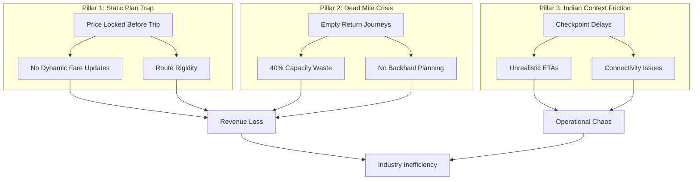

### Quantified Impact
| Problem | Current State | Target State |
|---------|--------------|--------------|
| Empty Return Trips | 35-40% of trips | <15% of trips |
| Capacity Utilization | 55-60% average | >80% average |
| Route Deviation Response | Manual, 30+ mins | Automated, <2 mins |
| Fare Accuracy | ±25% variance | ±8% variance |

---

## 3. Solution Overview

### The Neuro-Logistics Agentic System

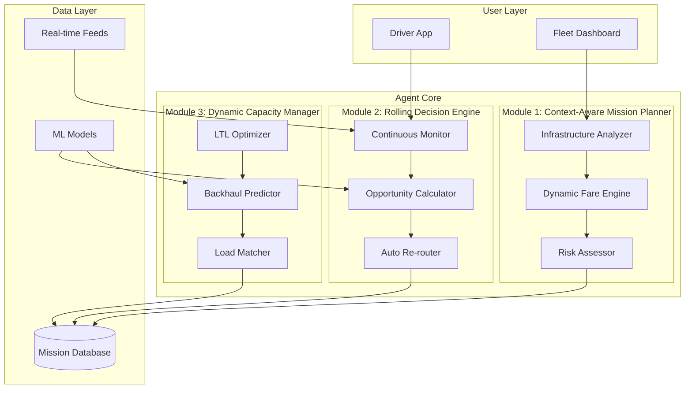

### Core Agent Loop

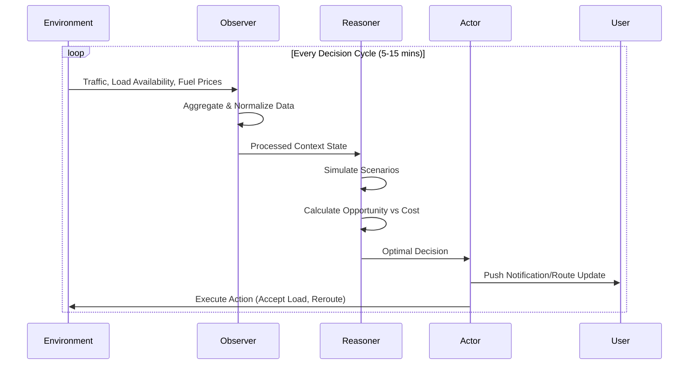

---

## 4. System Architecture

### High-Level Architecture

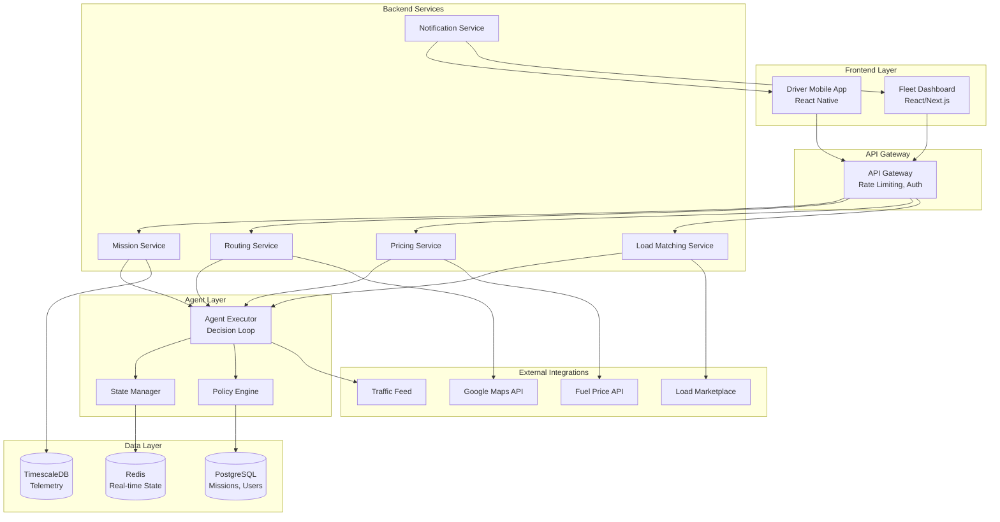

### Agent State Machine

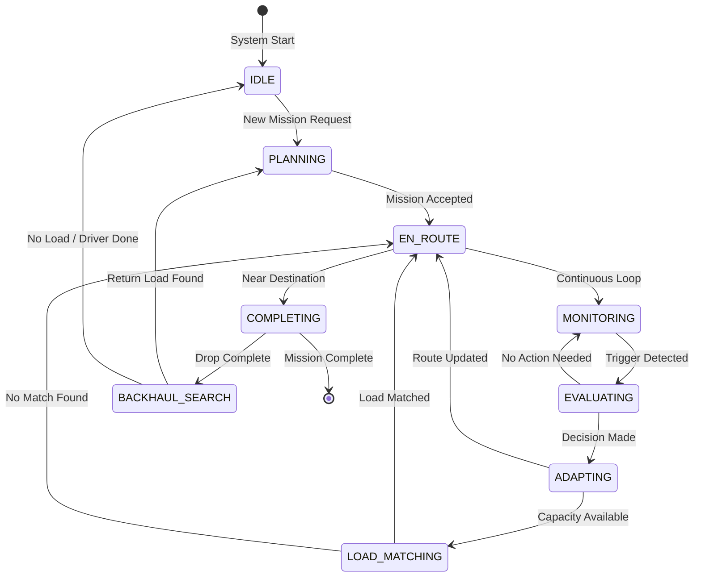

---

## 5. Module Specifications

### Module 1: Context-Aware Mission Planner

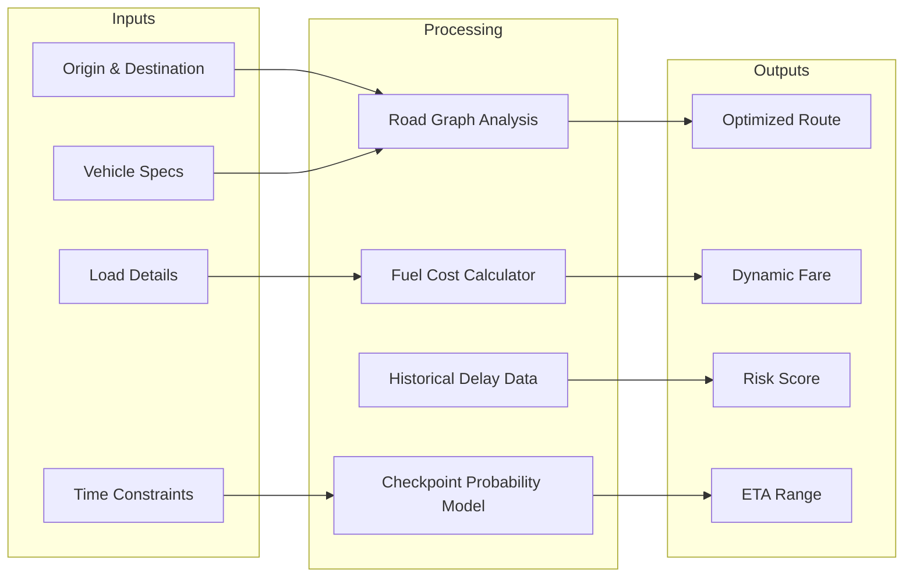

**Key Features:**
| Feature | Description | Priority |
|---------|-------------|----------|
| Infrastructure-Aware Routing | Considers truck-specific constraints (height, weight, no-entry zones) | P0 |
| Checkpoint Delay Prediction | ML model trained on state border crossing times | P0 |
| Dynamic Fare Calculation | Real-time pricing based on route difficulty, fuel, demand | P0 |
| Risk Assessment | Probability scores for delays, safety concerns | P1 |

### Module 2: Rolling Decision Engine

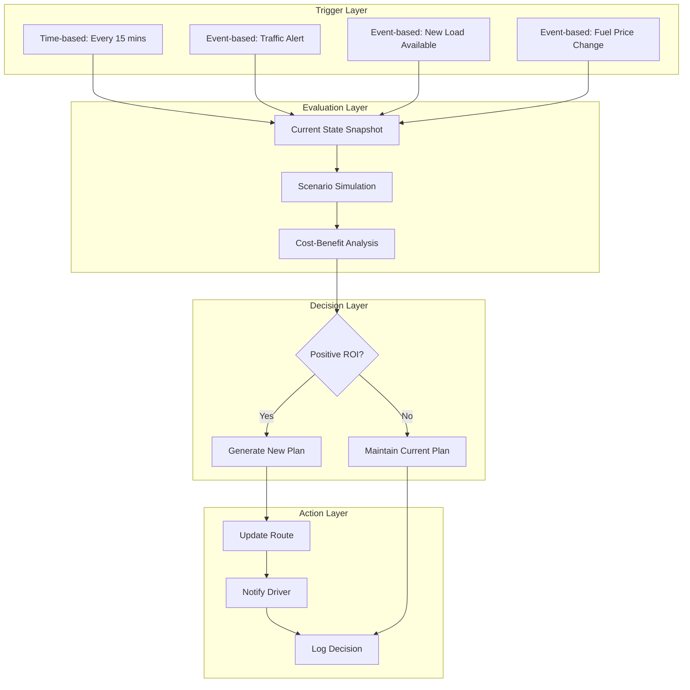

**Decision Triggers:**
| Trigger | Threshold | Action |
|---------|-----------|--------|
| Traffic Delay | >20 min deviation | Re-route evaluation |
| New Load Nearby | <15 km detour | Opportunity calculation |
| Fuel Price Spike | >5% increase | Refuel point optimization |
| Weather Alert | Severity > Medium | Safety re-routing |

### Module 3: Dynamic Capacity Manager

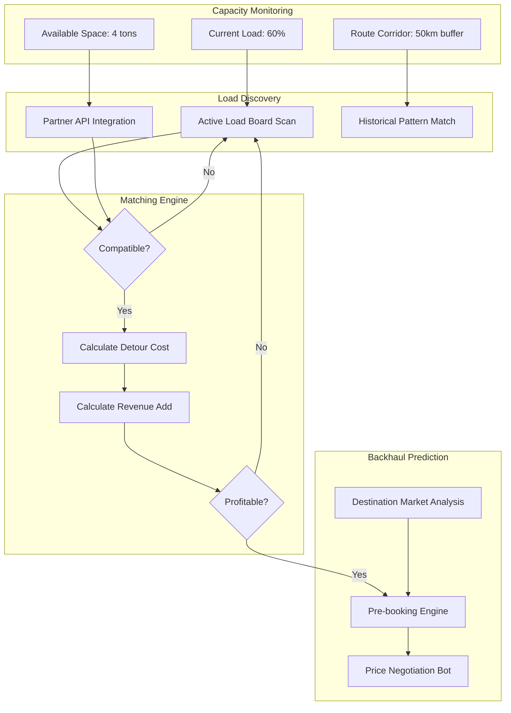

**Pooling Logic:**
```
Profitability Score = (Additional Revenue - Detour Cost - Time Cost) / Risk Factor

Where:
- Additional Revenue = Load Rate × Weight
- Detour Cost = Extra Distance × Fuel Rate
- Time Cost = Extra Time × Hourly Opportunity Cost  
- Risk Factor = 1.0 to 1.5 based on load type, shipper rating
```

---

## 6. Data Models

### Entity Relationship Diagram

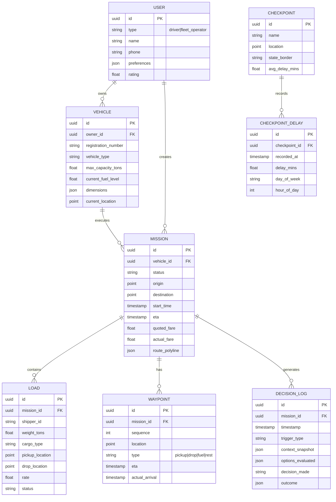

---

## 7. User Flows

### Flow 1: Driver Journey (Happy Path)

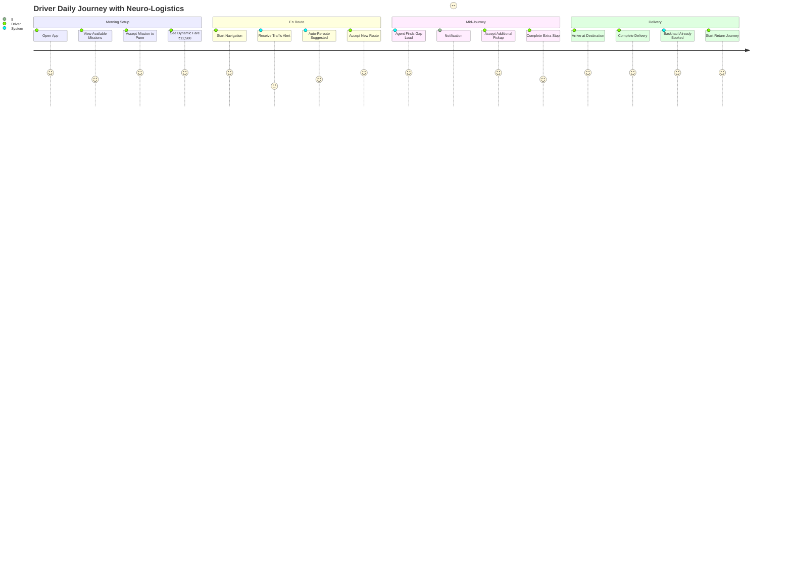

### Flow 2: Fleet Operator Dashboard

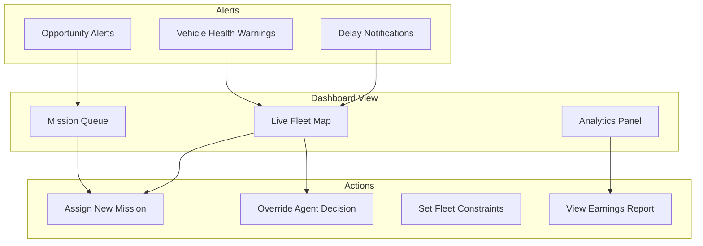

### Flow 3: Agent Decision Cycle

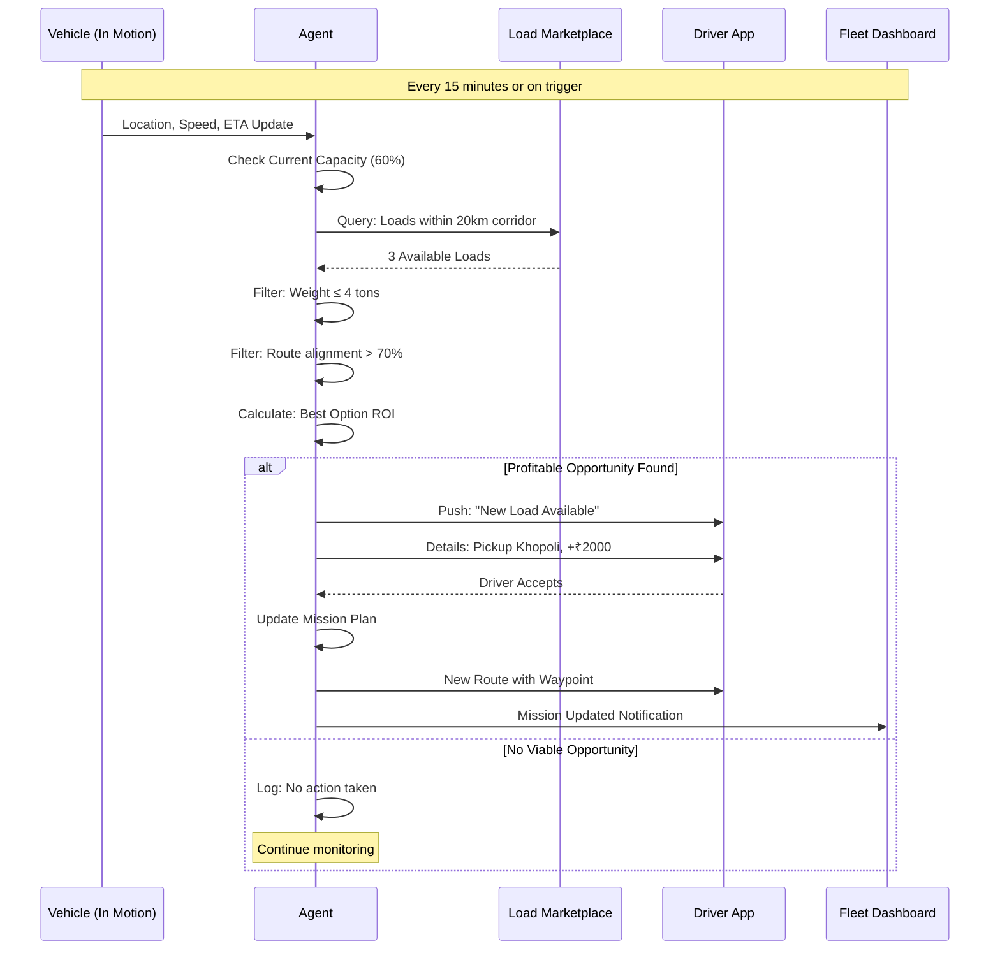

---

## 8. API Specifications

### Core API Endpoints

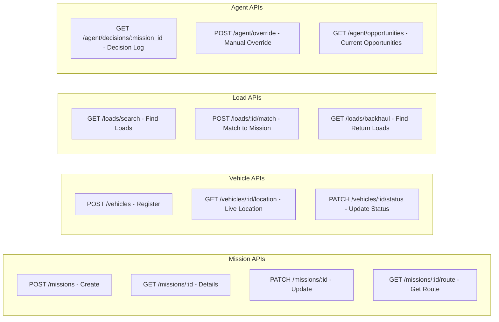

### Key API Contracts

**POST /missions**
```json
{
  "request": {
    "vehicle_id": "uuid",
    "origin": {"lat": 19.076, "lng": 72.877},
    "destination": {"lat": 18.520, "lng": 73.856},
    "load": {
      "weight_tons": 6,
      "cargo_type": "general",
      "pickup_time": "2026-01-31T08:00:00Z"
    },
    "constraints": {
      "max_detour_km": 30,
      "avoid_tolls": false,
      "preferred_rest_stops": []
    }
  },
  "response": {
    "mission_id": "uuid",
    "route": {
      "polyline": "encoded_string",
      "distance_km": 150,
      "duration_mins": 240,
      "eta_range": {
        "optimistic": "2026-01-31T12:00:00Z",
        "realistic": "2026-01-31T13:30:00Z",
        "pessimistic": "2026-01-31T15:00:00Z"
      }
    },
    "fare": {
      "base": 10000,
      "fuel_surcharge": 1500,
      "difficulty_premium": 1000,
      "total": 12500,
      "breakdown": {}
    },
    "risk_assessment": {
      "overall_score": 0.72,
      "factors": [
        {"type": "checkpoint_delay", "probability": 0.6, "impact_mins": 45},
        {"type": "traffic", "probability": 0.4, "impact_mins": 30}
      ]
    }
  }
}
```

---

## 9. Tech Stack

### Recommended Stack for Hackathon

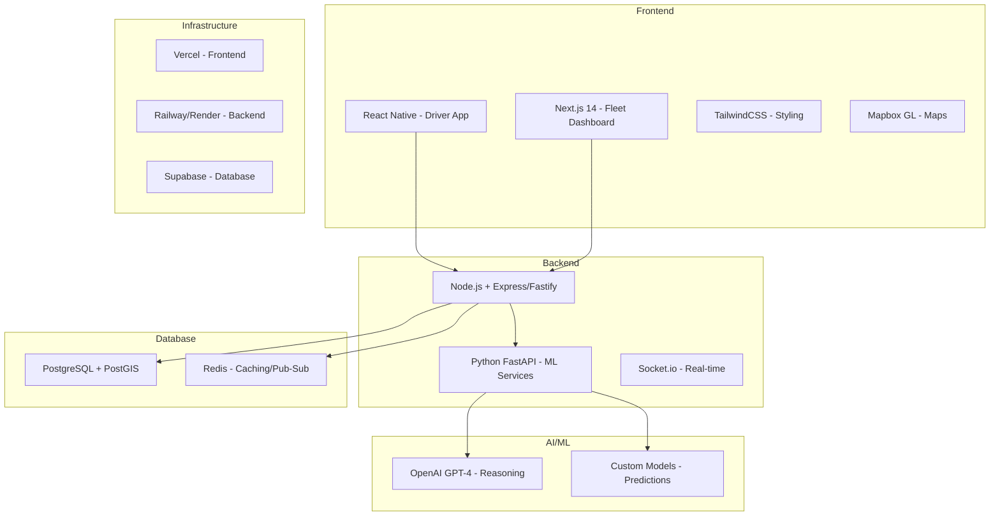

| Layer | Technology | Justification |
|-------|------------|---------------|
| Driver App | React Native + Expo | Cross-platform, fast development |
| Fleet Dashboard | Next.js 14 | SSR, API routes, fast iteration |
| Primary Backend | Node.js + Fastify | High performance, real-time support |
| ML/Agent Service | Python + FastAPI | ML ecosystem, LangChain support |
| Database | PostgreSQL + PostGIS | Spatial queries, reliability |
| Cache/Pub-Sub | Redis | Real-time state, fast lookups |
| Maps | Mapbox/Google Maps | Routing, traffic data |
| AI Reasoning | OpenAI GPT-4 / Claude | Complex decision making |

---

## 10. File Structure

### Project Structure

```
neuro-logistics/
├── apps/
│   ├── driver-app/              # React Native Driver App
│   │   ├── src/
│   │   │   ├── screens/
���   │   │   ├── components/
│   │   │   ├── hooks/
│   │   │   ├── services/
│   │   │   └── navigation/
│   │   └── app.json
│   │
│   └── fleet-dashboard/         # Next.js Fleet Dashboard
│       ├── app/
│       │   ├── dashboard/
│       │   ├── missions/
│       │   ├── vehicles/
│       │   └── analytics/
│       ├── components/
│       └── lib/
│
├── services/
│   ├── api-gateway/             # Main API Service
│   │   ├── src/
│   │   │   ├── routes/
│   │   │   ├── controllers/
│   │   │   ├── middleware/
│   │   │   └── utils/
│   │   └── package.json
│   │
│   ├── agent-service/           # Python Agent/ML Service
│   │   ├── app/
│   │   │   ├── agent/
│   │   │   │   ├── executor.py
│   │   │   │   ├── state.py
│   │   │   │   └── policies.py
│   │   │   ├── models/
│   │   │   ├── services/
│   │   │   └── api/
│   │   └── requirements.txt
│   │
│   └── notification-service/    # Push Notifications
│
├── packages/
│   └── shared/                  # Shared types, utilities
│       ├── types/
│       └── utils/
│
├── database/
│   ├── migrations/
│   └── seeds/
│
├── docs/
│   └── PRD.md
│
└── docker-compose.yml
```

---

## 11. Development Phases

### Hackathon 24-Hour Timeline

```mermaid
gantt
    title Neuro-Logistics 24-Hour Development Plan
    dateFormat HH:mm
    axisFormat %H:%M
    
    section Phase 1: Foundation (0-6 hrs)
    Project Setup & DB Schema           :p1, 00:00, 2h
    Core API Endpoints                  :p2, after p1, 2h
    Basic Driver App UI                 :p3, after p1, 3h
    Fleet Dashboard Shell               :p4, 02:00, 2h
    
    section Phase 2: Core Features (6-14 hrs)
    Mission Planner Module              :p5, 06:00, 3h
    Dynamic Fare Engine                 :p6, after p5, 2h
    Route Optimization                  :p7, 06:00, 3h
    Real-time Location Tracking         :p8, after p7, 2h
    
    section Phase 3: Agent Intelligence (14-20 hrs)
    Decision Engine Loop                :p9, 14:00, 3h
    Load Matching Algorithm             :p10, after p9, 2h
    Backhaul Prediction                 :p11, 17:00, 2h
    Notification System                 :p12, after p10, 1h
    
    section Phase 4: Polish (20-24 hrs)
    Integration Testing                 :p13, 20:00, 2h
    UI Polish & Demo Flow               :p14, after p13, 1h
    Demo Preparation                    :p15, 23:00, 1h
```

### MVP Feature Priority

| Priority | Feature | Time Estimate |
|----------|---------|---------------|
| P0 | Basic Mission Creation & Route Display | 3 hrs |
| P0 | Dynamic Fare Calculation | 2 hrs |
| P0 | Real-time Vehicle Tracking | 2 hrs |
| P0 | Agent Decision Loop (Basic) | 3 hrs |
| P1 | Load Matching for LTL | 2 hrs |
| P1 | Backhaul Suggestion | 2 hrs |
| P1 | Fleet Dashboard Overview | 2 hrs |
| P2 | Checkpoint Delay Prediction | 2 hrs |
| P2 | Historical Analytics | 2 hrs |

---

## 12. Success Metrics

### Demo Metrics (For Hackathon Judging)

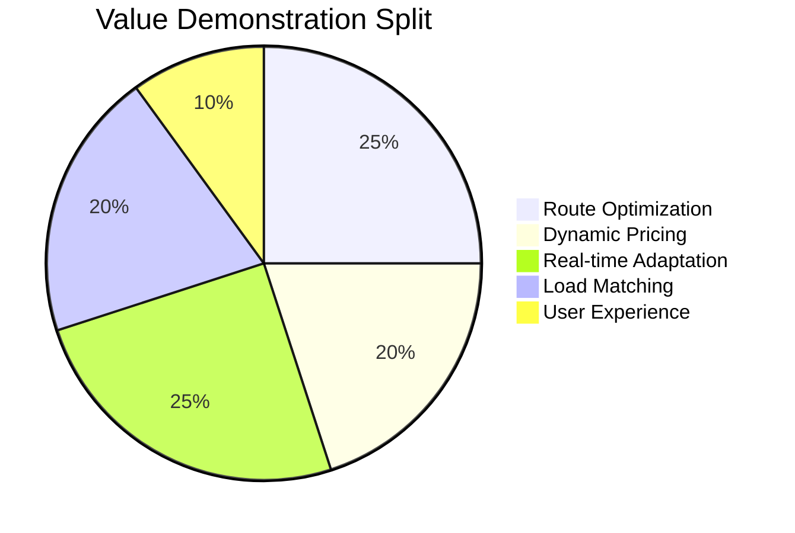

### KPIs to Showcase

| Metric | Demo Scenario | Expected Output |
|--------|---------------|-----------------|
| Route Efficiency | Mumbai → Pune trip | Shows checkpoint-aware routing saving 45 mins |
| Dynamic Pricing | Same trip, different times | Fare varies by ₹800-1500 based on conditions |
| Adaptation | Simulate traffic jam | Agent reroutes within 30 seconds |
| Load Matching | 60% capacity truck | Finds gap-filler load, +₹2000 revenue |
| Backhaul | Approaching destination | Pre-booked return load displayed |

---

## Appendix A: Glossary

| Term | Definition |
|------|------------|
| **Agentic System** | AI system that can autonomously observe, reason, and act |
| **Backhaul** | Return journey load to avoid empty miles |
| **Dead Mile** | Distance traveled without cargo (unprofitable) |
| **LTL** | Less Than Truckload - partial capacity shipments |
| **Mission** | A complete trip from origin to destination with all waypoints |
| **Rolling Decision** | Continuous re-evaluation while in motion |

---

## Appendix B: External API Dependencies

| API | Purpose | Fallback |
|-----|---------|----------|
| Google Maps Directions | Route calculation | OpenRouteService |
| Google Maps Traffic | Real-time traffic | Historical patterns |
| OpenAI GPT-4 | Complex reasoning | Rule-based decisions |
| Fuel Price API | Dynamic fuel costs | Last known + 5% buffer |

---

*Document Version: 1.0 | Last Updated: January 31, 2026*